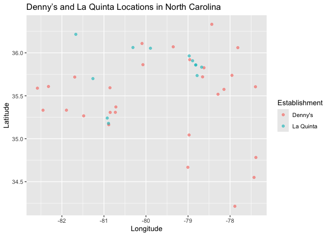
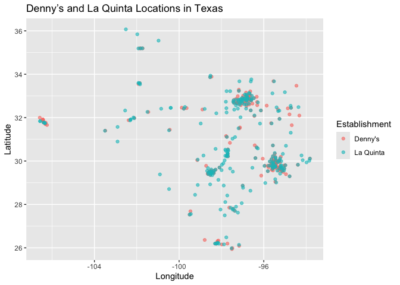

Lab 04 - La Quinta is Spanish for next to Denny’s, Pt. 1
================
Verity Elliott
01_31_2026

### Load packages and data

``` r
library(tidyverse) 
library(dsbox) 
```

``` r
states <- read_csv("data/states.csv")
```

### Exercise 1

The Denny’s dataset has 1,643 rows and 6 columns. Each row represents a
single Denny’s restaurant location in the United States. The variables
include the restaurant’s address, city, state, ZIP code, and geographic
coordinates (longitude and latitude).

``` r
nrow(dennys)
```

    ## [1] 1643

``` r
ncol(dennys)
```

    ## [1] 6

``` r
glimpse(dennys)
```

    ## Rows: 1,643
    ## Columns: 6
    ## $ address   <chr> "2900 Denali", "3850 Debarr Road", "1929 Airport Way", "230 …
    ## $ city      <chr> "Anchorage", "Anchorage", "Fairbanks", "Auburn", "Birmingham…
    ## $ state     <chr> "AK", "AK", "AK", "AL", "AL", "AL", "AL", "AL", "AL", "AL", …
    ## $ zip       <chr> "99503", "99508", "99701", "36849", "35207", "35294", "35056…
    ## $ longitude <dbl> -149.8767, -149.8090, -147.7600, -85.4681, -86.8317, -86.803…
    ## $ latitude  <dbl> 61.1953, 61.2097, 64.8366, 32.6033, 33.5615, 33.5007, 34.206…

### Exercise 2

The La Quinta dataset has 909 rows and 6 columns. Each row represents a
single La Quinta hotel location. The variables include the hotel’s
address, city, state, ZIP code, and geographic coordinates (longitude
and latitude).

``` r
nrow(laquinta)
```

    ## [1] 909

``` r
ncol(laquinta)
```

    ## [1] 6

``` r
glimpse(laquinta)
```

    ## Rows: 909
    ## Columns: 6
    ## $ address   <chr> "793 W. Bel Air Avenue", "3018 CatClaw Dr", "3501 West Lake …
    ## $ city      <chr> "\nAberdeen", "\nAbilene", "\nAbilene", "\nAcworth", "\nAda"…
    ## $ state     <chr> "MD", "TX", "TX", "GA", "OK", "TX", "AG", "TX", "NM", "NM", …
    ## $ zip       <chr> "21001", "79606", "79601", "30102", "74820", "75254", "20345…
    ## $ longitude <dbl> -76.18846, -99.77877, -99.72269, -84.65609, -96.63652, -96.8…
    ## $ latitude  <dbl> 39.52322, 32.41349, 32.49136, 34.08204, 34.78180, 32.95164, …

### Exercise 3

According to the La Quinta website, there are several La Quinta
locations outside of the United States. These international locations
are located in China, including cities such as Chengdu, Qionghai,
Suzhou, Taiyuan, Turpan, Weifang, and Zunyi.

The Denny’s website indicates that Denny’s has 1259 locations within the
United States, though it was only through the power of Google that I
found international locations, including restaurants in Canada, Mexico,
and Puerto Rico (though PR is technically domestic). That same Google
search revealed that Denny’s started as a donut stand in Lakewood, CA in
1953. The more you know.

### Exercise 4

Using only the data, I can think of several potential ways to determine
whether either establishment has locations outside of the United States.
One approach would be to examine the state variable and check whether
all values correspond to valid U.S. state abbreviations. Any entries
that do not match U.S. states could indicate international locations.
Unless that abbreviation is “NA,” of course.

Another possible approach would be to use the longitude and latitude
variables to see whether any locations fall outside the geographic
boundaries of the United States. Locations with coordinates far outside
U.S. ranges may suggest international restaurants.

A third option would be to check ZIP codes and identify any values that
do not conform to the standard U.S. ZIP code format. An alpanumeric zip
code, for instance, may indicate a restaurant located in Canada.

### Exercise 5

Filtering the Denny’s dataset for locations with a state not in
states\$abbreviation shows no rows, indicating that all Denny’s
restaurants in this dataset are located in the United States. That
is,there are no international locations included in the dataset.

``` r
dennys %>%
  filter(!(state %in% states$abbreviation))
```

    ## # A tibble: 0 × 6
    ## # ℹ 6 variables: address <chr>, city <chr>, state <chr>, zip <chr>,
    ## #   longitude <dbl>, latitude <dbl>

### Exercise 6

A new variable country was added to the Denny’s dataset using mutate().
All observations were set to “United States”. The dataset now includes
seven variables, with country representing the country for each
restaurant.

``` r
dennys <- dennys %>%
  mutate(country = "United States")
```

### Exercise 7

As noted previously, some La Quinta locations in the dataset are outside
the United States. Based on the La Quinta website, these international
locations are in China, including cities such as Chengdu, Qionghai,
Suzhou, Taiyuan, Turpan, Weifang, and Zunyi.

### Exercise 8

A new variable country was added to the La Quinta dataset using mutate()
and case_when().All locations in U.S. states were set to “United
States”, while all other locations were set to “China” based on notes
from the previous exercise.

``` r
laquinta <- laquinta %>%
  mutate(country = case_when(
    state %in% state.abb ~ "United States",  # all U.S. states
    TRUE ~ "China"                           # all other locations
  ))
```

The dataset was then filtered to include only U.S. locations so that
future analysis will focus on domestic La Quinta hotels.

``` r
laquinta <- laquinta %>%
  filter(country == "United States")
```

After adding the country variable and filtering for U.S. locations, the
La Quinta dataset contains 895 observations. This confirms that only
domestic locations remain for analysis, while international locations
(e.g., in China) have been excluded.

``` r
table(laquinta$country)
```

    ## 
    ## United States 
    ##           895

### Exercise 9

The number of locations for each Denny’s and La Quinta was counted by
state using count(). I then joined these counts with the states dataset
to include the full state names and geographic area (in square miles).

``` r
dennys_with_area <- dennys %>%
  count(state) %>%  # Count number of Denny's locations per state
  inner_join(states, by = c("state" = "abbreviation"))  # Join state area info

dennys_with_area
```

    ## # A tibble: 51 × 4
    ##    state     n name                     area
    ##    <chr> <int> <chr>                   <dbl>
    ##  1 AK        3 Alaska               665384. 
    ##  2 AL        7 Alabama               52420. 
    ##  3 AR        9 Arkansas              53179. 
    ##  4 AZ       83 Arizona              113990. 
    ##  5 CA      403 California           163695. 
    ##  6 CO       29 Colorado             104094. 
    ##  7 CT       12 Connecticut            5543. 
    ##  8 DC        2 District of Columbia     68.3
    ##  9 DE        1 Delaware               2489. 
    ## 10 FL      140 Florida               65758. 
    ## # ℹ 41 more rows

``` r
laquinta_with_area <- laquinta %>%
  count(state) %>%  # Count number of La Quinta locations per state
  inner_join(states, by = c("state" = "abbreviation"))  # Join state area info

laquinta_with_area
```

    ## # A tibble: 48 × 4
    ##    state     n name           area
    ##    <chr> <int> <chr>         <dbl>
    ##  1 AK        2 Alaska      665384.
    ##  2 AL       16 Alabama      52420.
    ##  3 AR       13 Arkansas     53179.
    ##  4 AZ       18 Arizona     113990.
    ##  5 CA       56 California  163695.
    ##  6 CO       27 Colorado    104094.
    ##  7 CT        6 Connecticut   5543.
    ##  8 FL       74 Florida      65758.
    ##  9 GA       41 Georgia      59425.
    ## 10 IA        4 Iowa         56273.
    ## # ℹ 38 more rows

### Exercise 10

After adjusting for state size, the District of Columbia has the highest
density of Denny’s locations, followed by small states such as Rhode
Island and Connecticut. For La Quinta, Rhode Island and Florida rank
highest in locations per thousand square miles. This pattern is
expected, as smaller states and densely populated areas tend to have
higher location densities than larger states with more dispersed
populations.Notably, Rhode Island ranks highly for both Denny’s and La
Quinta, indicating a strong presence of both establishments relative to
the state’s geographic size. I decided to Google where Mitch Hedberg
is/was from, wondering if he might be from Rhode Island. Nope. Saint
Paul, MN. He did, however, do a show at the University of Rhode Island
in 2004.

``` r
dennys_density <- dennys_with_area %>%
  mutate(locations_per_1000_sq_miles = n / (area / 1000)) %>%
  arrange(desc(locations_per_1000_sq_miles))

dennys_density
```

    ## # A tibble: 51 × 5
    ##    state     n name                     area locations_per_1000_sq_miles
    ##    <chr> <int> <chr>                   <dbl>                       <dbl>
    ##  1 DC        2 District of Columbia     68.3                      29.3  
    ##  2 RI        5 Rhode Island           1545.                        3.24 
    ##  3 CA      403 California           163695.                        2.46 
    ##  4 CT       12 Connecticut            5543.                        2.16 
    ##  5 FL      140 Florida               65758.                        2.13 
    ##  6 MD       26 Maryland              12406.                        2.10 
    ##  7 NJ       10 New Jersey             8723.                        1.15 
    ##  8 NY       56 New York              54555.                        1.03 
    ##  9 IN       37 Indiana               36420.                        1.02 
    ## 10 OH       44 Ohio                  44826.                        0.982
    ## # ℹ 41 more rows

``` r
laquinta_density <- laquinta_with_area %>%
  mutate(locations_per_1000_sq_miles = n / (area / 1000)) %>%
  arrange(desc(locations_per_1000_sq_miles))

laquinta_density
```

    ## # A tibble: 48 × 5
    ##    state     n name             area locations_per_1000_sq_miles
    ##    <chr> <int> <chr>           <dbl>                       <dbl>
    ##  1 RI        2 Rhode Island    1545.                       1.29 
    ##  2 FL       74 Florida        65758.                       1.13 
    ##  3 CT        6 Connecticut     5543.                       1.08 
    ##  4 MD       13 Maryland       12406.                       1.05 
    ##  5 TX      237 Texas         268596.                       0.882
    ##  6 TN       30 Tennessee      42144.                       0.712
    ##  7 GA       41 Georgia        59425.                       0.690
    ##  8 NJ        5 New Jersey      8723.                       0.573
    ##  9 MA        6 Massachusetts  10554.                       0.568
    ## 10 LA       28 Louisiana      52378.                       0.535
    ## # ℹ 38 more rows

### Exercise 11

In North Carolina, there are 31 cities with at least one Denny’s or La
Quinta location. Of these, only 3 cities have both establishments,
meaning that roughly 10% of the cities contain both. Visually, the
scatter plot shows some locations that are fairly close together, but
true co-location within the same city is relatively rare. Based on this
data, Mitch Hedberg’s joke that “La Quinta means next to a Denny’s” only
occasionally holds in North Carolina. That said, one city in which both
establishments are present is good ol’ Winston-Salem.

``` r
# Add establishment identifiers
dennys <- dennys %>%
  mutate(establishment = "Denny's")

laquinta <- laquinta %>%
  mutate(establishment = "La Quinta")

# Combine datasets
dn_lq <- bind_rows(dennys, laquinta)

# Filter combined data to North Carolina
dn_lq_nc <- dn_lq %>%
  filter(state == "NC") %>%
  mutate(city = str_trim(city))  # Remove extra spaces/newlines

# Plot locations with transparency
ggplot(dn_lq_nc, aes(
  x = longitude,
  y = latitude,
  color = establishment
)) +
  geom_point(alpha = 0.6) +
  labs(
    title = "Denny’s and La Quinta Locations in North Carolina",
    x = "Longitude",
    y = "Latitude",
    color = "Establishment"
  )
```

<!-- -->

``` r
# Count locations by establishment
dn_lq_nc %>%
  count(establishment)
```

    ## # A tibble: 2 × 2
    ##   establishment     n
    ##   <chr>         <int>
    ## 1 Denny's          28
    ## 2 La Quinta        12

``` r
# Check city-level overlap between establishments
city_overlap_nc <- dn_lq_nc %>%
  distinct(city, establishment) %>%
  count(city) %>%
  arrange(desc(n))

city_overlap_nc
```

    ## # A tibble: 31 × 2
    ##    city               n
    ##    <chr>          <int>
    ##  1 Charlotte          2
    ##  2 Durham             2
    ##  3 Raleigh            2
    ##  4 Asheville          1
    ##  5 Battleboro         1
    ##  6 Black Mountain     1
    ##  7 Boone              1
    ##  8 Cary               1
    ##  9 Concord            1
    ## 10 Conover            1
    ## # ℹ 21 more rows

``` r
# Summarize overlap proportion
city_overlap_nc %>%
  summarise(
    total_cities = n(),
    cities_with_both = sum(n == 2),
    proportion_with_both = mean(n == 2)
  )
```

    ## # A tibble: 1 × 3
    ##   total_cities cities_with_both proportion_with_both
    ##          <int>            <int>                <dbl>
    ## 1           31                3               0.0968

### Exercise 12

In Texas, there are 199 cities with at least one Denny’s or La Quinta
location. Of these, 67 cities have both establishments, meaning that
about one-third of the cities contain both. The scatter plot shows that
many of these locations are quite close together, supporting Mitch
Hedberg’s joke that “La Quinta means next to a Denny’s” more often in
Texas than in North Carolina.

``` r
# Filter combined data to Texas
dn_lq_tx <- dn_lq %>%
  filter(state == "TX") %>%
  mutate(city = str_trim(city))  # Remove extra spaces/newlines

# Plot locations with transparency
ggplot(dn_lq_tx, aes(
  x = longitude,
  y = latitude,
  color = establishment
)) +
  geom_point(alpha = 0.6) +
  labs(
    title = "Denny’s and La Quinta Locations in Texas",
    x = "Longitude",
    y = "Latitude",
    color = "Establishment"
  )
```

<!-- -->

``` r
# Count locations by establishment
dn_lq_tx %>%
  count(establishment)
```

    ## # A tibble: 2 × 2
    ##   establishment     n
    ##   <chr>         <int>
    ## 1 Denny's         200
    ## 2 La Quinta       237

``` r
# Check city-level overlap between establishments
city_overlap_tx <- dn_lq_tx %>%
  distinct(city, establishment) %>%
  count(city) %>%
  arrange(desc(n))

city_overlap_tx
```

    ## # A tibble: 199 × 2
    ##    city            n
    ##    <chr>       <int>
    ##  1 Abilene         2
    ##  2 Allen           2
    ##  3 Amarillo        2
    ##  4 Arlington       2
    ##  5 Austin          2
    ##  6 Baytown         2
    ##  7 Big Spring      2
    ##  8 Brenham         2
    ##  9 Brookshire      2
    ## 10 Brownsville     2
    ## # ℹ 189 more rows

``` r
# Summarize overlap proportion
city_overlap_tx %>%
  summarise(
    total_cities = n(),
    cities_with_both = sum(n == 2),
    proportion_with_both = mean(n == 2)
  )
```

    ## # A tibble: 1 × 3
    ##   total_cities cities_with_both proportion_with_both
    ##          <int>            <int>                <dbl>
    ## 1          199               67                0.337
